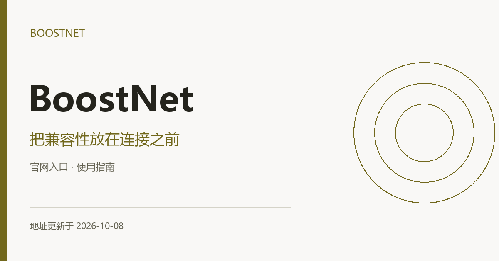

# BoostNet机场官网入口｜AnyTLS与VPN客户端兼容 **（更新于2026-10-08）**

**简体中文** · [繁體中文](README.zh-TW.md) · [English](README.en.md) · [日本語](README.ja.md) · [한국어](README.ko.md) · [Русский](README.ru.md)

本项目由BoostNet官方发布与维护。BoostNet机场官方入口与VPN客户端兼容指南：AnyTLS配置核对、软件与内核版本、设备规则、连接错误定位及入口源码。 准备 BoostNet 加速器配置时，订阅能被导入和客户端能建立连接需要分别确认。

**地址更新于 2026-10-08（北京时间）**

[官网入口](#official-addresses) · [使用步骤](#usage-guide) · [术语与接入方式](#connection-terms) · [常见问题](#brand-faq)

## BoostNet · BoostNet机场官方地址

| 入口 | 访问地址 |
| --- | --- |
| 入口 1 | [vpn.boostnetvpn.com](https://vpn.boostnetvpn.com/) |
| 入口 2 | [boostnet.boostnetvpn.com](https://boostnet.boostnetvpn.com/) |
| 入口 3 | [boostnetvpn.com](https://boostnetvpn.com/) |

以上链接是网站入口，供访问服务信息与管理账户使用；它们不是个人订阅链接，也不是代理节点。多个域名可能连接同一账户服务，不代表独立备用线路或速度差异。

## 客户端版本与连接环境一起检查

BoostNet 的接入资料涉及 AnyTLS 等协议名称。本指南侧重版本兼容、设备规则和日常使用边界，帮助你在安装后用清楚的步骤定位连接问题。

### 1. 确认当前协议支持

先看账户推荐的软件与最低版本。即使软件能导入文本，也要确认其内核支持订阅实际使用的协议。

### 2. 更新后保留对照

更新客户端前记下版本与当前配置来源；更新后手动刷新订阅，检查节点数量和错误提示。

### 3. 核对使用范围

在大量下载、多人使用或路由器部署前阅读服务条款，确认允许的设备数与用途。

## BoostNet：机场订阅、VPN 与加速器客户端是什么关系？

VPN 通常指虚拟专用网络；本指南中的“机场”指订阅代理服务，“加速器”是更宽泛的软件或服务称呼，具体接入能力以账户文档为准。

“科学上网”和“魔法”是网络访问场景中的常见俗称，不是固定协议、独立套餐或速度保证。

账户提供订阅和接入参数，客户端负责解析与连接。导入成功不等于协议兼容；更换软件时仍要确认格式、协议及内核版本。

## 使用体验如何检查

把地区、运营商、时段、客户端版本和目标应用保持一致，再比较连接结果。持续访问、下载峰值和应用地区识别是不同指标；失败或超时也应记录。本文未发布本次实测速度或实时节点状态。

可在自己的设备上记录以下信息，向账户支持反馈时隐藏个人凭据：

| 记录项 | 填写方式 |
| --- | --- |
| 设备与网络 | 系统、客户端版本、运营商及 Wi-Fi／移动数据 |
| 当前配置 | 节点名称、订阅更新时间，不记录密钥 |
| 具体场景 | 应用名称、操作步骤与观察到的结果 |
| 发生时间 | 注明日期、时间及所在时区 |

## BoostNet常见问题

### 导入成功为什么仍提示不支持协议？

导入只代表配置被读入。应用版本与网络内核可能独立更新，需按接入说明同时核对。

### BoostNet 的网页地址能当订阅地址吗？

不能。网页用于进入账户，个人订阅需要从登录后的配置区域获取。

### 当前套餐价格与活动在哪里确认？

进入账户查看当前订单，核对实付金额、付款周期、流量重置、有效期、设备限制与售后条件。历史截图和旧优惠码不能代替当前交易条款。

## 使用本仓库的入口网页

`index.html` 提供BoostNet入口导航、完整域名、复制按钮、操作指南和阅读确认清单。可在本地打开，也可将本目录放在静态 Web 服务器上使用；页面无需构建，不收集账户信息，不自动跳转。仓库推送本身不会部署网站。

## 更新与反馈

地址或文档有误，可在本仓库提交 Issue，附上域名、发生时间与页面提示。登录、订单和付款问题请通过账户页面的支持渠道处理。不要公开密码、支付信息或个人订阅链接。更新日期随地址清单的实际变更维护，不按访问或构建自动刷新。
